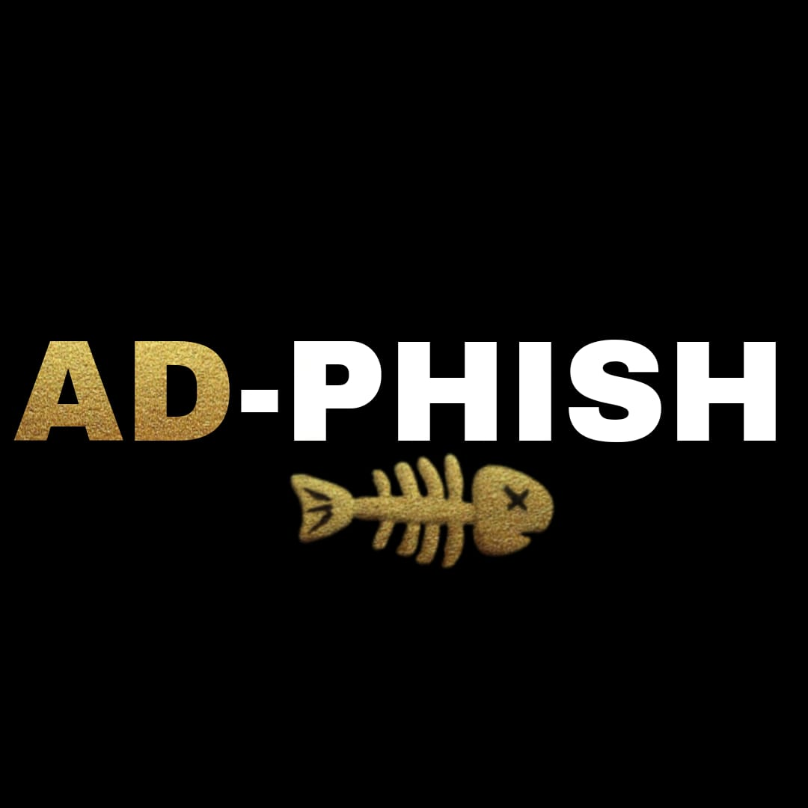

<!-- AD-PHISH -->

<p align="center">
  
</p>
<h2>This Tool is Developed by Anaaas</h2>
<p align="center">
  
  
  
  
</p>

<p align="center">
  
  
</p>

<p align="center">A beginners friendly, Automated phishing tool with 30+ templates.</p>

##

<h3><p align="center">Disclaimer</p></h3>

<i>Any actions and or activities related to <b>AD-PHISH</b> is solely your responsibility. The misuse of this toolkit can result in <b>criminal charges</b> brought against the persons in question. <b>The contributors will not be held responsible</b> in the event any criminal charges be brought against any individuals misusing this toolkit to break the law.

<b>This toolkit contains materials that can be potentially damaging or dangerous for social media</b>. Refer to the laws in your province/country before accessing, using,or in any other way utilizing this in a wrong way.

<b>This Tool is made for educational purposes only</b>. Do not attempt to violate the law with anything contained here. <b>If this is your intention, then Get the hell out of here</b>!

It only demonstrates "how phishing works". <b>You shall not misuse the information to gain unauthorized access to someones social media</b>. However you may try out this at your own risk.</i>

##

### Features

- Latest and updated login pages.
- Mask URL support 
- Beginners friendly
- Docker support (checkout `docker-legacy` branch)
- Multiple tunneling options
  - Localhost
  - Ngrok (With or without hotspot)
  - Cloudflared (Alternative of Ngrok)


### Installation

- Just, Clone this repository -
```
$ git clone https://github.com/anasdh06/AD-PHISH.git

```

- Change to cloned directory and run `adphish.sh` -
```
$ cd AD-PHISH
$ bash adphish.sh
```

- On first launch, It'll install the dependencies and that's it. `AD-PHISH` is installed.

### Run on Docker
```
$ docker pull anasdh06/adphish
$ docker run --rm -it anasdh06/adphish
```

### Dependencies

**`AD-PHISH`** requires following programs to run properly - 
- `php`
- `wget`
- `curl`
- `git`

> All the dependencies will be installed automatically when you run `AD-PHISH` for the first time.

> Supported Platform : **`Termux`**, **`Ubuntu/Debian/Kali/Parrot`**, **`Arch Linux/Manjaro`**, **`Fedora`**

<p align="center">
  
</p>
<p align="center">
  
</p>


